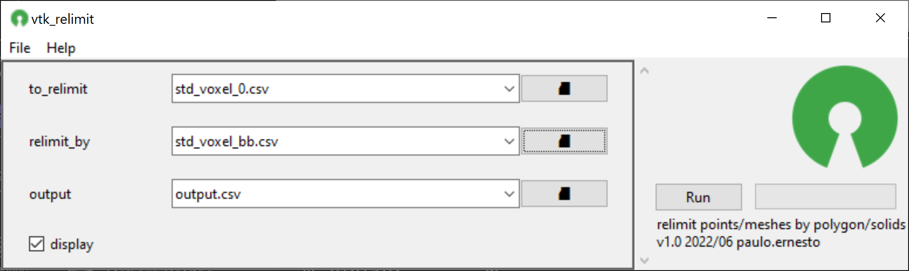
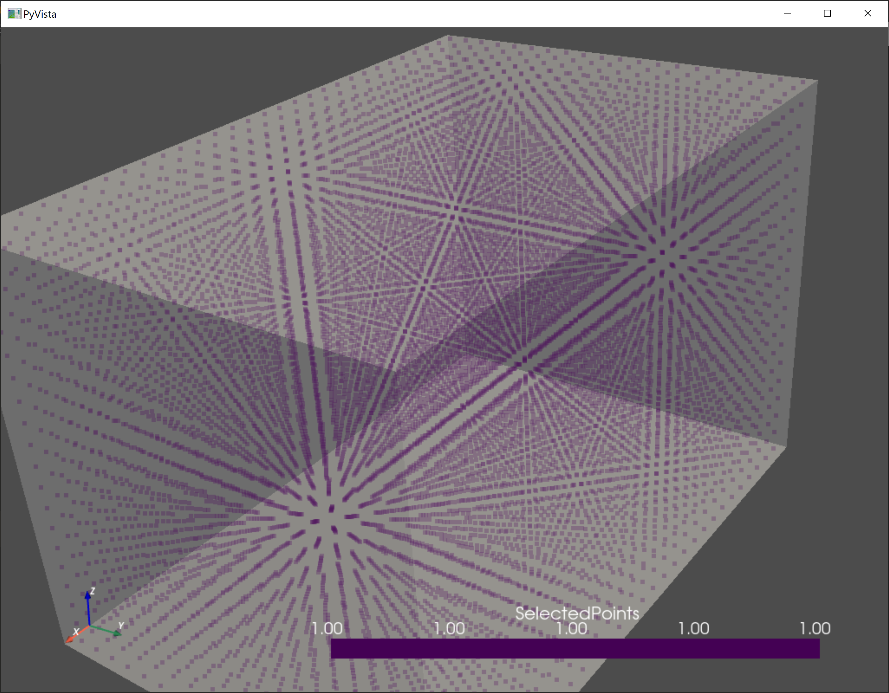

## 📌 Description
relimit points/meshes by polygon/solids
## 📸 Screenshot

## 📝 Parameters
Name|optional|description
---|---|------
||❎||
||☑️||
to_relimit|❎|points or triangulation to be relimited
relimit_by|❎|boundary polygon or solid
output|☑️|path to save the relimited data
display||display results in a 3d window
## 📓 Notes
All files can be in any of the supported formats:  
 - ASCII headered csv
 - Vulcan 00t triangulation
 - Vulcan dgd objects
 - Leapfrog msh mesh
 - Wavefront obj
 - VTK data file

## 📚 Examples

## 💎 License
Apache 2.0
